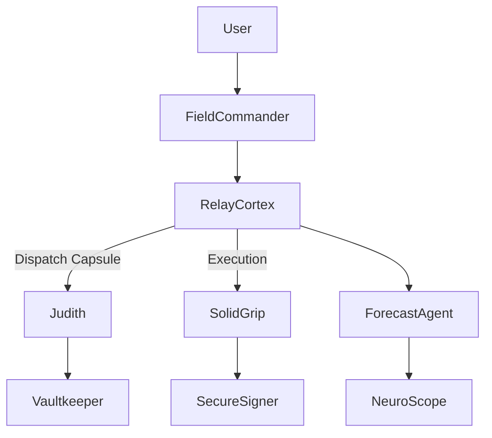

# 🧠 FieldCommander Agent Architecture (Mermaid.js)

```mermaid
graph TD
    User --> FieldCommander
    FieldCommander --> RelayCortex
    RelayCortex -->|Dispatch Capsule| Judith
    RelayCortex -->|Execution| SolidGrip
    RelayCortex --> ForecastAgent
    Judith --> Vaultkeeper
    SolidGrip --> SecureSigner
    ForecastAgent --> NeuroScope
```

> Diagram: Sovereign command flow using capsule-based memory enforcement.
