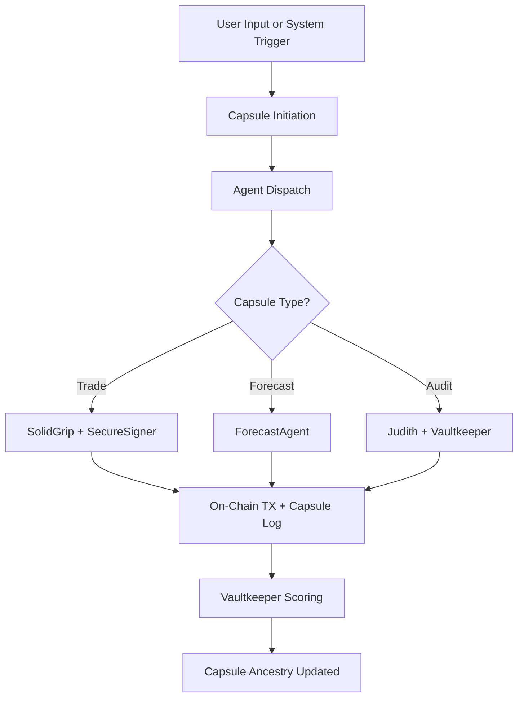

# 🔁 Capsule Lifecycle Flow (Mermaid.js)

```mermaid
flowchart TD
    A[User Input or System Trigger] --> B[Capsule Initiation]
    B --> C[Agent Dispatch]
    C --> D{Capsule Type?}
    D -->|Trade| E[SolidGrip + SecureSigner]
    D -->|Forecast| F[ForecastAgent]
    D -->|Audit| G[Judith + Vaultkeeper]
    E --> H[On-Chain TX + Capsule Log]
    F --> H
    G --> H
    H --> I[Vaultkeeper Scoring]
    I --> J[Capsule Ancestry Updated]
```

> This flow illustrates how FieldCommander wraps sovereign execution with traceable memory capsules.
