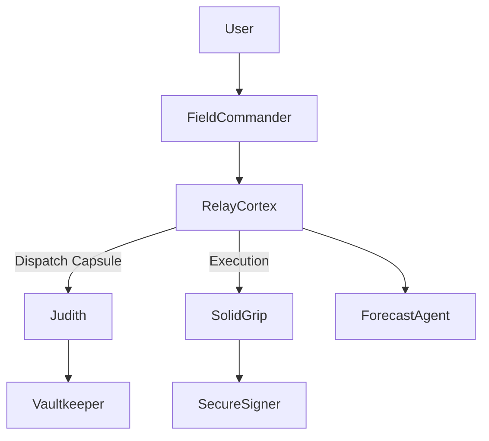

# FieldCommander ⚔️

**A mobile-first, role-aware governance interface for sovereign AI systems**

FieldCommander is the control terminal for Divergent Assets — enabling secure, traceable, and compliant interaction with autonomous agents like ForecastAgent, Judith, and SecureSigner. Built with memory-bound capsule logic and anti-AGI governance at its core, FieldCommander enforces role separation, capsule ancestry, and EO14178-aligned transparency.

---

## 📌 Overview

| Feature               | Description                                                                 |
|-----------------------|-----------------------------------------------------------------------------|
| 🌐 Stack              | Next.js, TailwindCSS, ShadCN UI, Vercel-ready                              |
| 🧠 Capsule Logic      | Supports memory-bound, role-restricted AI agents via Judith + Vaultkeeper  |
| 🔐 Secure Execution   | Integrates SecureSigner for private key protection + on-chain dispatch     |
| 📦 Agent Support      | ForecastAgent, Judith, SolidGrip, NeuroScope, RelayCortex                  |
| 📱 Mobile Priority     | Designed for biometric auth, offline fallback, and sovereign PWA command   |

---

## 🚀 What It Does

- Dispatch commands to ForecastAgent, Judith, SolidGrip
- View agent roles, memory state, task status, capsule ROI
- Launch secure on-chain trades, AI forecasts, and governance proposals
- Trace every interaction to capsule + signer lineage

FieldCommander is **not a frontend.** It's a memory-aware governance stack for recursive, role-bound AI systems.

---

## 🔒 EO14178 Compliance Snapshot

| EO14178 Pillar               | Status                       |
|-----------------------------|------------------------------|
| ✅ Agent Traceability        | Capsule ancestry + signer ID |
| ✅ Sanctions Awareness       | Judith + Vaultkeeper alerts  |
| ✅ Tech-Neutral Risk Scoring | NeuroScope + ForecastAgent   |
| ✅ Privacy-Preserving ID     | Mobile biometrics (ZK-ready) |
| ✅ Role Enforcement          | A-T-E-G schema (Agent, Tool, Executor, Guardian) |

---

## 🧠 Agent Loop Roles

---

## 📄 License

This project is licensed under the **Sovereign Loop Protocol License (SLPL v1.0)**. Highlights:

- ✅ Free to use for compliant, non-AGI-seeking agent ecosystems
- 🔒 No usage for surveillance, centralized LLM training, or AGI bootstrapping
- ⚖️ Attribution required if forked

See [LICENSE](./LICENSE) for full terms.

---

## 📚 Learn More

- Capsule Philosophy → [mirror.xyz/keith-charlie](https://mirror.xyz/keith-charlie)
- IP & Patents → `GENOMIC-MUTATION-ENGINE-0802X`, `QCCW`, `SOFTLOOP-PATTERN-0001`
- Regulatory Alignment → [EO14178 Summary](https://www.whitehouse.gov/wp-content/uploads/2025/07/Digital-Assets-Report-EO14178.pdf)

---

## 📫 Contact

For questions, collaborations, or validation inquiries:

**📧 divergentassets@proton.me**

> Sovereign governance inquiries welcome.

---

## 📜 Patent Disclosure

This repository is supported by a **filed provisional patent** with the USPTO:

**Patent Title**: Genomic Mutation Engine for Recursive AI Governance  
**Filing Date**: July 2025  
**Reference ID**: GENOMIC-MUTATION-ENGINE-0802X (provisional)

This filing covers:
- Agent memory lineage and fork scoring
- Sovereign capsule lifecycle governance
- Role-separated execution and mutation reusability

All logic in this repository is derived from or protected under this filing.  
Re-use, fork, or derivative work may require licensing.

---

> "FieldCommander isn't just an interface. It's the final form of agent governance."

— Divergent Assets
